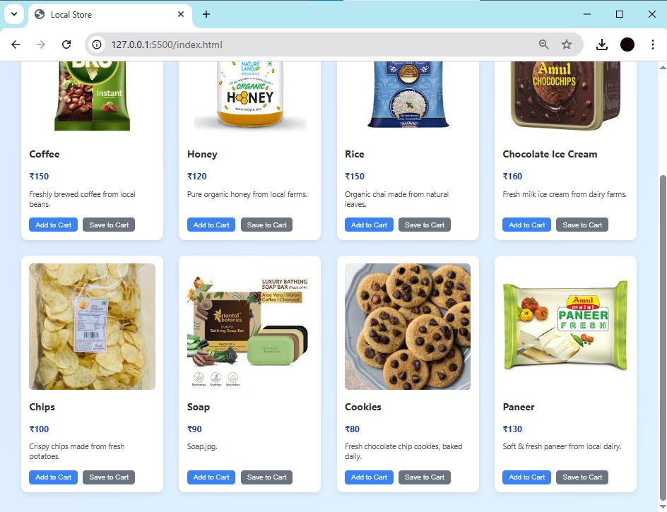
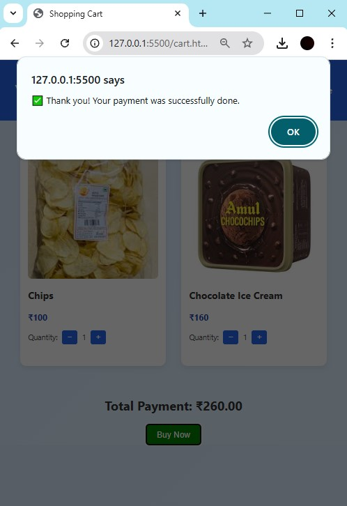

# Local Store E‑Commerce Platform
 
A full-featured e-commerce site for a local merchant with product browsing, cart & checkout capabilities, and MongoDB support.


## 🖼️ Screenshots

### Home / Product Listing


### Product Details
 

### Shopping Cart
  

### Successful
 
---

## ✅ Features

- Browse products with images, names, prices, and descriptions  
- Product detail pages  
- Shopping cart: add/remove, item count, and total cost  
- Simple checkout flow (no payment gateway yet)  
- Products stored in **MongoDB** – dynamic loading and management  
- Responsive layout for desktop and mobile

---

## 🛠️ Tech Stack

| Layer      | Technology               |
|------------|--------------------------|
| Frontend   | HTML, CSS, JavaScript    |
| Backend    | Node.js + Express        |
| Database   | MongoDB                  |
| Others     | Mongoose for ORM         |
| Tools      | Postman, Prettier, ESLint|

---


## 🚀 Getting Started

1. **Clone the repo:**
   ```bash
   git clone https://github.com/Asish7980/PRODIGY_FS_03.git
   cd PRODIGY_FS_03
Install dependencies:

bash
Copy
Edit
npm install
Configure environment variables:
Create a .env file:

ini
Copy
Edit
MONGODB_URI=mongodb://localhost:27017/prodigy_store
PORT=3000
▶️ Running the App
Start MongoDB (e.g., mongod)

Seed initial product data (optional):

bash
Copy
Edit
node backend/seed.js
Start the server:

bash
Copy
Edit
npm start
Open in browser: http://localhost:3000

📂 Folder Structure
bash
Copy
Edit
PRODIGY_FS_03/
├─ backend/         # Express server & MongoDB models
├─ ui/              # Static frontend files
├─ .env             # Config variables
├─ package.json
└─ README.md
🛠️ Future Enhancements
Integrate a payment gateway (Stripe/PayPal)

Add user authentication + order history

Implement an admin dashboard (CRUD for products)

Enhance UI with a CSS framework (Bootstrap/Tailwind)

Add order confirmation emails via NodeMailer

👨‍💻 Author
Asish Shaw
