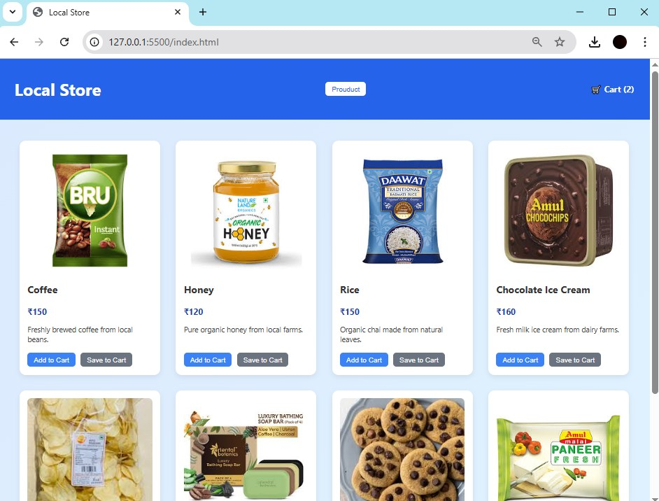
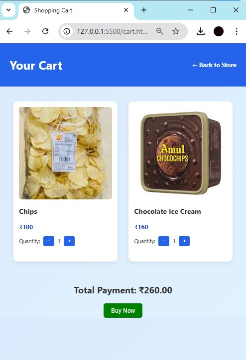

# 🛍️🛒 Local Store E‑Commerce Platform
 
A full-featured e-commerce site for a local merchant with product browsing, cart & checkout capabilities, and MongoDB support.


## 🖼️ Screenshots

### Home / Product Listing


### Product Details
 

### Shopping Cart
  

### Successful
 


## ✅ Features
```
- Browse products with images, names, prices, and descriptions  
- Product detail pages  
- Shopping cart: add/remove, item count, and total cost   
- Products stored in **MongoDB** – dynamic loading and management  
- Responsive layout for desktop and mobile
```


## 🛠️ Tech Stack

| Layer      | Technology               |
|------------|--------------------------|
| Frontend   | HTML, CSS, JavaScript    |
| Backend    | Node.js + Express        |
| Database   | MongoDB                  |
| Others     | Mongoose for ORM         |
| Tools      | Postman, Prettier, ESLint|


## 🚀 Getting Started

1. **Clone the repo:**
   ```
   git clone https://github.com/Asish7980/PRODIGY_FS_03.git
   ```
   ```
   cd PRODIGY_FS_03
   ```
2. **Install dependencies:**
```
npm install
```
3. **Configure environment variables:**

Create a `.env` file:

```
MONGODB_URI=mongodb://localhost:27017/prodigy_store
PORT=3000
```

## ▶️ Running the App
1. Start MongoDB (e.g., `mongod`)

2. Start the server:

```
npm start
```
Open in browser: http://localhost:3000

## 📂 Folder Structure
```
PRODIGY_FS_03/
├─ images/
├─ screenshots/
├─ LICENSE
├─ cart.html
├─ index.html
├─ README.md
├─ script.js
├─ settings.json
├─ package.json
└─ style.css
```
## 🛠️ Future Enhancements
Integrate a payment gateway (Stripe/PayPal)

Add user authentication + order history

Implement an admin dashboard (CRUD for products)

Enhance UI with a CSS framework (Bootstrap/Tailwind)

Add order confirmation emails via NodeMailer

## 👨‍💻 Author
**Asish Shaw**
